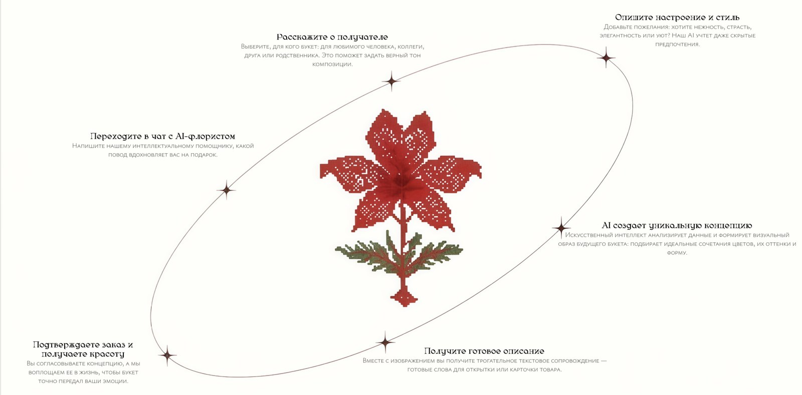
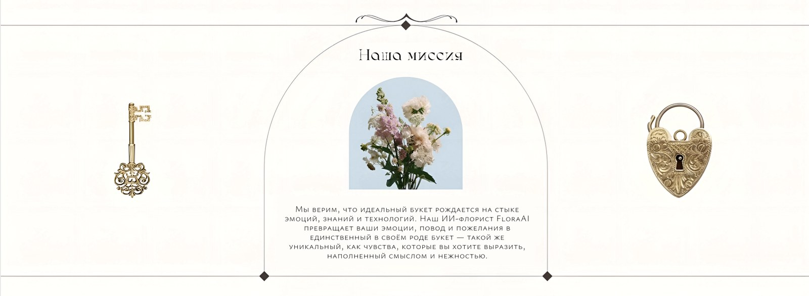

<div align="center">

# FloraAI Frontend

**Клиентская часть FloraAI — персонального AI-флориста, который генерирует уникальный букет по вашим предпочтениям**


</div>

Интерактивное веб-приложение, которое задаёт пользователю вопросы о предпочтениях и отправляет запрос на бэкенд для генерации уникального букета.

## О проекте 

FloraAI — это сервис, который помогает создать идеальную цветочную композицию для любого случая. Пользователь отвечает на 6 вопросов о предпочтениях (цвета, стиль, повод и т.д.), после чего приложение отправляет сформированный промпт на сервер, где с помощью YandexART генерируется изображение уникального букета.

### Основные функции:
- Интерактивный опрос из 6 вопросов
- Формирование текстового промпта на основе ответов
- Отправка запроса на генерацию изображения
- Отображение статуса генерации
- Показ готового изображения букета
- Возможность начать заново

## Интерфейс 

### Путь пользователя

От рассказа о получателе до готового изображения букета и текста для открытки:



### Миссия проекта

<p align="center">
  
</p>

## Технологии:

- **HTML5** — структура страницы
- **CSS3** — стилизация, анимации, адаптивность
- **JavaScript (ES6+)** — логика опроса, взаимодействие с API
- **Fetch API** — отправка запросов к бэкенду
- **Интеграция с бэкендом** — обмен данными через REST API

## 🚀 Запуск локально

### Способ 1: Простой (открыть файл)
1. Скачайте файлы проекта
2. Откройте `index.html` в браузере
3. Убедитесь, что бэкенд запущен на `http://localhost:3001`

### Способ 2: Через локальный сервер (рекомендуется)
```bash
# Установите простой сервер (если нет)
npm install -g serve

# Запустите в папке с проектом
serve .

# Или используйте Python
python -m http.server 8000
```

Приложение будет доступно по адресу `http://localhost:8000`

## 🔧 Настройка подключения к бэкенду

В файле `script.js` найдите строки с адресом API:

```javascript
const API_URL = 'http://localhost:3001';
```

При необходимости измените порт или URL в зависимости от того, где запущен бэкенд:
- Локально: `http://localhost:3001`
- На сервере: `https://ваш-домен.com` (без порта, если настроен прокси)

## Адаптивность 

Приложение корректно отображается на:
- Десктопах (широкие экраны)
- Планшетах (768px — 1024px)
- Мобильных устройствах (до 768px)

## Как это работает

1. **Приветственный экран** — краткое описание сервиса, кнопка "Начать"
2. **Опрос из 6 вопросов**:
   - Вопрос 1: Цветовая гамма
   - Вопрос 2: Стиль букета
   - Вопрос 3: Повод
   - Вопрос 4: Размер букета
   - Вопрос 5: Наличие дополнительных элементов
   - Вопрос 6: Особые пожелания
3. **Генерация промпта** — на основе ответов формируется текстовое описание
4. **Отправка на бэкенд** — промпт отправляется на `/api/generate`
5. **Отображение результата** — после генерации показывается изображение букета
6. **Кнопка "Создать новый"** — позволяет начать процесс заново

## 🎨 Особенности интерфейса

- **Плавные переходы** между вопросами (анимация появления)
- **Визуальная обратная связь** (загрузка, ошибки)
- **Красивая цветовая гамма** в пастельных тонах
- **Кастомные элементы форм** (радиокнопки, чекбоксы)
- **Адаптивные карточки** для вариантов ответов

## 📡 Взаимодействие с API

### Отправка промпта:
```javascript
POST /api/generate
{
  "prompt": "Букет в нежных пастельных тонах, в стиле бохо, на день рождения, среднего размера, с лентами и сухоцветами",
  "orderId": "уникальный-идентификатор"
}
```

### Проверка статуса:
```javascript
GET /api/check-order/:orderId
// Ответ: { status: "completed", imageUrl: "https://..." }
// или { status: "pending" }
```

### Получение результата:
После успешной генерации отображается изображение из Cloudinary.

## 🚀 Деплой

### Вариант 1: Вместе с бэкендом на Timeweb Cloud
- Фронтенд-файлы (`index.html`, `style.css`, `script.js`) можно разместить в папке `public` бэкенда
- Сервер будет отдавать их по корневому маршруту `/`

### Вариант 2: Отдельно на статическом хостинге
- **Netlify**: просто перетащите папку с файлами
- **Vercel**: автоматический деплой из GitHub
- **GitHub Pages**: бесплатный хостинг для статики

### Вариант 3: Через Timeweb Cloud (статический сайт)
1. Создайте статический сайт в панели Timeweb
2. Загрузите файлы через FTP или GitHub
3. Укажите в настройках CORS адрес бэкенда

## 🔒 CORS

Если фронтенд и бэкенд находятся на разных доменах, убедитесь, что бэкенд разрешает CORS. В `server.js` уже настроены разрешённые источники:

```javascript
app.use(cors({
    origin: [
        'http://127.0.0.1:5501', 
        'http://localhost:5501', 
        'http://localhost:3000',
        'https://floramind-7idk.onrender.com',
        'https://ваш-домен.com' // добавьте ваш домен
    ]
}));
```

## 🛠 Возможные проблемы

<details>
<summary>Частые ошибки при локальном запуске</summary>

**Ошибка "Failed to fetch"**
- Проверьте, запущен ли бэкенд
- Убедитесь, что URL в `script.js` правильный
- Проверьте CORS настройки на бэкенде

**Изображение не отображается**
- Проверьте, пришёл ли `imageUrl` в ответе
- Убедитесь, что ссылка ведёт на существующее изображение
- Откройте ссылку напрямую в браузере

**Вопросы не переключаются**
- Проверьте консоль браузера на наличие ошибок JavaScript

</details>

---

## Связанные репозитории

- [floramind_project](https://github.com/katshuuu/floramind_project) — бэкенд: генерация изображений через YandexART, хранение в Cloudinary
- [FloraMind_chat](https://github.com/katshuuu/FloraMind_chat) — Telegram-бот с визуальным тестом, который собирает предпочтения для букета

**Автор:** [katshuuu](https://github.com/katshuuu)
